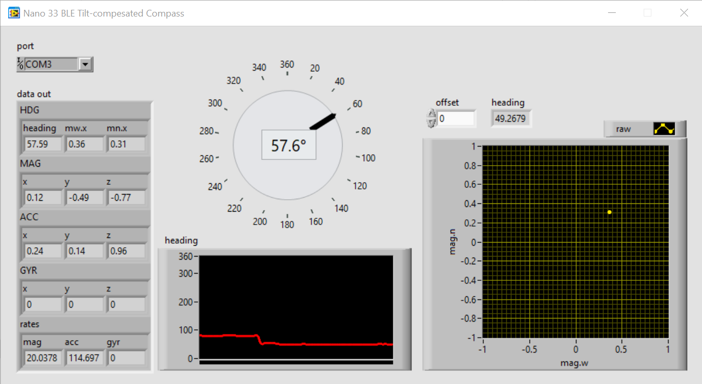

# Tilt-compensated Compass for Arduino Nano 33 BLE

This example project demonstrates how to use the Arudino Nano 33 BLE
as a tilt-compensated compass.

# Hardware
* [Arduino Nano 33 BLE Sense](https://docs.arduino.cc/hardware/nano-33-ble-sense)

# Pre-requisites
* [Visual Studio Code](https://code.visualstudio.com/download)
* [Platform.io](https://platformio.org/) (Install from Visual Studio Code)
* [Python](https://www.python.org/downloads/) (Platform.io requires Python)

Note: This project is not intended to be used from the Arudino IDE.

# Build instructions
1. Download and install Visual Studio Code and Python.
2. Install the Platform.io plugin in Visual Studio Code.
3. Open the project folder in Visual Studio Code. The project should be recognized as a Platform.io project.
4. Choose "Build", then "Upload" from the Platform.io toolset.

# Calibrating your Nano 33 BLE IMU
Each [LSM9DS1](https://www.arduino.cc/en/Reference/ArduinoLSM9DS1) sensor is unique and requires a unique
calibration. You will need to generate a calibration for your device and update the calibration
constants defined in [compass-support.h](src/compass-support.h).

The algorithm implmented in this project requires accelerometer and magnetometer readings to be nomalized
to a spere of radius 1. The can be accomplished using the included calibration tool the support project, or 
by using any other method of [fitting a sphere](https://jekel.me/2015/Least-Squares-Sphere-Fit/).

